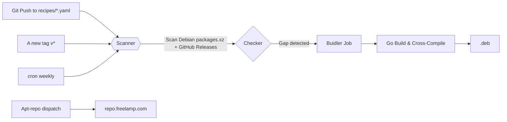

# deb-builder — Automatic Debian Package Builder for Go Projects

Generate multi-arch `.deb` packages from GitHub Releases (amd64/arm64/armhf/riscv64/loong64) for the `repo.freelamp.com` APT repository. Supports **Debian gaps** filling: if Debian lacks a particular architecture, we'll build it automatically.

## 🎯 How It Works



1. **Scanner**: Downloads `deb.debian.org/dists/{bookworm,trixie}/.../Packages.xz`, finds packages with `Homepage: github.com/*`. Output: `candidates.json`
2. **Checker**: Cross-checks official GitHub Releases + Debian Architecture coverage → classifies into 3 types:
   - ✅ **Debian covered** (skip, no need to build)
   - ⚠️ **Official .deb exists** (re-host same asset)
   - 🔴 **Gap detected** (build from source!)
3. **Builder**: Uses recipes (YAML config) + Go cross-compiler to build `.deb` for missing arches → auto-push to `repo.freelamp.com`.

## 📦 POC Packages in Phase 0

| Package | GitHub Repo | Debian Coverage Gap | Target Arch(es) |
|---------|-------------|---------------------|-----------------|
| gdu | [dundee/gdu](https://github.com/dundee/gdu) | All arches (Debian only provides `source`) | amd64, arm64, loong64, riscv64 |
| ripgrep | [BurntSushi/ripgrep](https://github.com/BurntSushi/ripgrep) | bookworm/trixie missing riscv64+loong64 | loong64, riscv64 (priority) |

## 🛠️ Usage

### Local Development

```bash
# 1. Add a new package recipe (edit recipes/gdu.yaml or create a new one)
vim recipes/mynewapp.yaml

# 2. Run the scanner + checker locally to verify gaps
go run ./cmd/scan -local testdata/sample-Packages -suite bookworm -arch amd64
go run ./cmd/check -candidates candidates.json

# 3. Build manually (for testing)
bash scripts/build-gdu.sh v5.36.1
```

### CI / GitHub Actions

- **On `push`**: Triggers build for all modified recipes + triggers weekly cron scan
- **On tag `v*`**: Builds all packages (ensures consistency with upstream release)
- **Manually trigger** (`workflow_dispatch`): Specify a single package to build

```bash
gh workflow run build.yml --repo LeisureLinux/deb-builder -f package=gdu
```

## 📂 Project Structure

```
deb-builder/
├── cmd/
│   ├── scan/      # Debian packages scanner (finds GitHub packages)
│   └── check/     # Gap checker (triages official .debs + Debian coverage)
├── recipes/       # YAML build recipes (one per package)
│   ├── gdu.yaml
│   └── ripgrep.yaml
├── scripts/       # Build orchestration helpers (build-go-deb.sh, etc.)
├── conf/          # Configuration files (suites.txt, debian-aliases.txt)
├── testdata/      # Local fixtures for scanner validation
├── .github/workflows/
│   └── build.yml  # CI builds and dispatch to apt-repo
└── go.mod         # Go module definition
```

## 🔐 Security & License

- All generated `.deb` packages are built from open-source upstream projects.
- `aptly` manages signing keys (`APT_GPG_PRIVATE_KEY`) in repository secrets.
- Only packages not already provided by Debian official repositories are built to avoid conflicts.

## 📄 License

MIT — See LICENSE file for details.

---

**Contributions welcome!** Open an issue or PR if you want a new package added to the APT repo.
